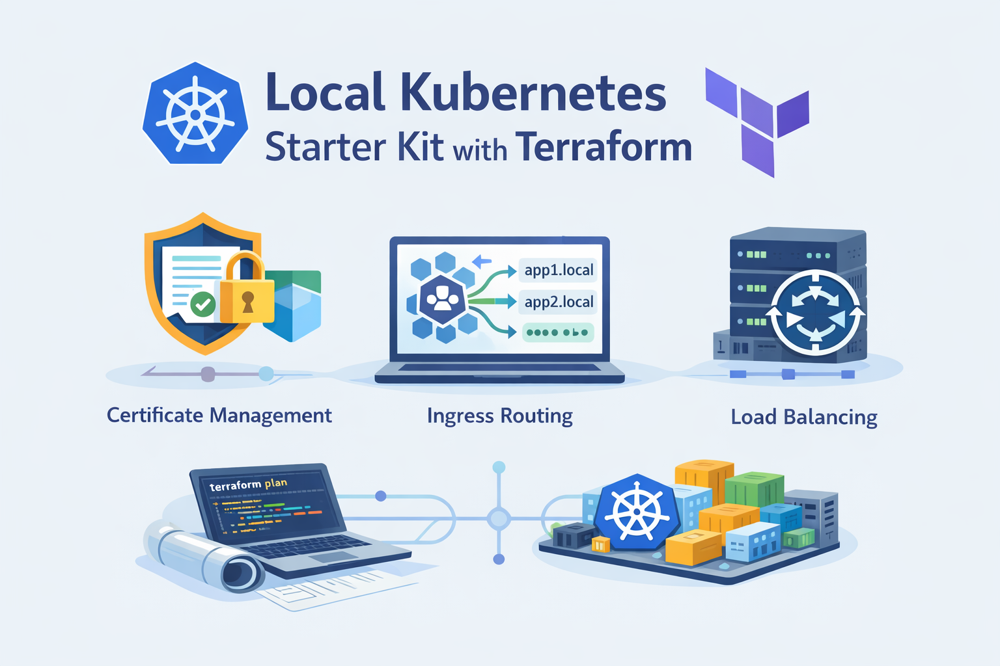

**English** | [Русский](README.ru.md)

[](https://github.com/itcaat/terraform-kubernetes-desktop-startkit/actions/workflows/k8s.yml)

# Terraform Kubernetes — Starter Kit for Docker Desktop

This starter kit is designed for local Kubernetes experimentation using Terraform. It provides a preconfigured setup with certificate management, ingress routing, and load balancing, making it easy to test, learn, and prototype cloud-native deployments.



## Who is it for?
- DevOps Engineers & SREs who want a sandbox for testing infrastructure automation.
- Developers exploring Kubernetes deployments without cloud costs.
- Teams learning Terraform and Kubernetes best practices in a safe, local environment.

## What You Will Build

By the end of this guide, you will have a fully working local Kubernetes cluster with the following components:

1. **MetalLB** — a load balancer that assigns real IP addresses to services in your local cluster (in cloud environments this is handled by the cloud provider, but locally we need MetalLB).
2. **Ingress-Nginx** — an ingress controller that routes incoming HTTP/HTTPS traffic to the right services based on hostname and path.
3. **cert-manager** — an operator that automates the creation and renewal of TLS certificates.
4. **ClusterIssuer (self-signed)** — uses your local mkcert CA to issue certificates trusted by your browser.
5. **ClusterIssuer (production)** — a pre-configured issuer for Let's Encrypt (ready for real domains).
6. **Echo Server** — a demo application that returns a JSON response with details about the incoming request. It serves as the end-to-end test: if you can reach `https://echo.127.0.0.1.nip.io` and get a JSON response over HTTPS with a valid certificate, it means the entire stack — DNS, load balancing, ingress routing, TLS certificates, and the application itself — is working correctly.

All of this is defined as Terraform code using separate modules, so you can easily add your own applications later by following the same pattern as the echo server.

## Project Structure

### **Environments**
- `envs/local` - Local Environment. You can use Docker Desktop for local usage.

### **Modules**
Each service is managed as a separate module for better reusability and organization.

| Module | Description |
|--------|-------------|
| `modules/metallb` | Deploys **MetalLB** via Helm. Configures IP address pools dynamically using `kubectl_manifest`. |
| `modules/cert-manager` | Installs **Cert-Manager** using Helm. |
| `modules/ingress-nginx` | Deploys **Ingress-Nginx** as a controller for managing ingress traffic. |
| `modules/cluster-issuer-selfsigned` | Creates a **ClusterIssuer** and a self-signed CA certificate. |
| `modules/cluster-issuer-production` | Creates a **ClusterIssuer** that uses Let's Encrypt. |
| `modules/echo-server` | Deploys **Echo Server** with an Ingress resource and self-signed TLS issued by Cert-Manager. |

## Getting Started

### Prerequisites

Before you begin, make sure you have the following installed on your machine.

#### 1. Docker Desktop with Kubernetes

1. Install [Docker Desktop](https://www.docker.com/products/docker-desktop/).
2. Open Docker Desktop, go to **Settings > Kubernetes**.
3. Check **Enable Kubernetes** and click **Apply & Restart**.
4. Wait until the Kubernetes status indicator in the bottom-left corner turns green.

Verify:
```sh
kubectl cluster-info
```
You should see something like:
```
Kubernetes control plane is running at https://127.0.0.1:6443
```

#### 2. Terraform

Install [Terraform](https://developer.hashicorp.com/terraform/install) (version >= 1.5.0).

Verify:
```sh
terraform version
```

#### 3. mkcert

mkcert creates locally-trusted development certificates. It automatically installs a local CA in the system trust store.

| OS | Command |
|----|---------|
| macOS | `brew install mkcert` |
| Linux | `sudo apt install -y libnss3-tools && brew install mkcert` or [build from source](https://github.com/FiloSottile/mkcert#linux) |
| Windows | `choco install mkcert` |

After installing:
```sh
mkcert -install
```

The `mkcert -install` command adds the root CA to your system trust store. This is what allows browsers and `curl` to trust the self-signed certificates.

### Step 1: Get the Repository

Fork or clone the repository:
```sh
git clone https://github.com/itcaat/terraform-kubernetes-desktop-startkit.git
cd terraform-kubernetes-desktop-startkit
```

### Step 2: Set Environment Variables

Terraform needs the mkcert CA certificate and key to create self-signed certificates inside the cluster. Export them as base64-encoded environment variables.

**macOS / Linux:**
```sh
export TF_VAR_cluster_issuer_selfsigned_ca_cert="$(base64 < "$(mkcert -CAROOT)/rootCA.pem")"
export TF_VAR_cluster_issuer_selfsigned_ca_key="$(base64 < "$(mkcert -CAROOT)/rootCA-key.pem")"
```

**Windows (PowerShell):**
```powershell
$env:TF_VAR_cluster_issuer_selfsigned_ca_cert = [Convert]::ToBase64String([IO.File]::ReadAllBytes("$(mkcert -CAROOT)\rootCA.pem"))
$env:TF_VAR_cluster_issuer_selfsigned_ca_key = [Convert]::ToBase64String([IO.File]::ReadAllBytes("$(mkcert -CAROOT)\rootCA-key.pem"))
```

**Important:** these variables must be set in the same terminal session where you run Terraform commands. If you open a new terminal, you need to export them again.

You can add these lines to your `~/.zshrc`, `~/.bashrc`, or PowerShell profile to make them persistent.

### Step 3: Configuration

You can override default locals by editing the `envs/local/locals.tf` file:
```hcl
locals {
  kube_config_path                     = "~/.kube/config"
  kube_context                         = "docker-desktop"
  ingress_class_name                   = "nginx"
  cluster_issuer_selfsigned            = "selfsigned"
  cluster_issuer_production            = "production"
  cluster_issuer_production_acme_email = "admin@example.com"
  root_domain                          = "127.0.0.1.nip.io"
  metallb_ip_range                     = ["127.0.0.1-127.0.0.1"]
}
```

### Step 4: Initialize Terraform

Navigate to the local environment directory and initialize Terraform:
```sh
cd envs/local
terraform init -upgrade
```

This downloads all required Terraform providers and modules. You should see:
```
Terraform has been successfully initialized!
```

### Step 5: Review the Plan

```sh
terraform plan
```

This shows what Terraform will create without making any changes. Review the output to understand what resources will be deployed:
- MetalLB (load balancer for local Kubernetes)
- cert-manager (certificate management)
- Ingress-Nginx (HTTP/HTTPS routing)
- ClusterIssuers (self-signed and production)
- Echo Server (demo application)

### Step 6: Deploy

```sh
terraform apply
```

Terraform will show the plan and ask for confirmation. Type `yes` and press Enter.

Alternatively, to skip the confirmation:
```sh
terraform apply -auto-approve
```

This takes a few minutes. Wait for:
```
Apply complete! Resources: XX added, 0 changed, 0 destroyed.
```

### Step 7: Verify the Deployment

Check that all pods are running:
```sh
kubectl get pods -A
```
All pods in `metallb-system`, `ingress-nginx`, `cert-manager`, and `demo` namespaces should be in `Running` status.

Check that services have received IP addresses:
```sh
kubectl get svc -A
```
The `ingress-nginx-controller` service should have `EXTERNAL-IP` set to `127.0.0.1` (assigned by MetalLB).

Check that ingress is created:
```sh
kubectl get ingress -A
```

Check that the TLS certificate has been issued:
```sh
kubectl get certificates -A
```
The `READY` column should show `True`. If it shows `False`, wait a minute — cert-manager might still be processing.

Test the echo server:
```sh
curl https://echo.127.0.0.1.nip.io
```
You should receive a JSON response. This confirms the entire stack works:
- DNS resolution via nip.io
- MetalLB assigned an IP to the ingress controller
- Ingress-Nginx routes the request to the echo server
- cert-manager issued a valid TLS certificate
- The echo server is running and responding

If you see an SSL error, make sure you ran `mkcert -install`. As a workaround:
```sh
curl -k https://echo.127.0.0.1.nip.io
```

You can also open https://echo.127.0.0.1.nip.io in your browser.

### Step 8: Clean Up

When you are done experimenting, run the following from the `envs/local` directory:

**Remove all resources:**
```sh
terraform destroy
```

**Full reset (destroy + delete state + redeploy from scratch):**
```sh
terraform destroy -auto-approve
cd ../..
rm -rf envs/local/.terraform envs/local/terraform.tfstate envs/local/terraform.tfstate.backup
cd envs/local
terraform init -upgrade
terraform apply -auto-approve
```

## What's Next?

At this point you have a fully working Kubernetes stack on your local machine:
- **MetalLB** assigns `127.0.0.1` as an external IP to your ingress controller.
- **Ingress-Nginx** routes HTTPS requests by hostname to the correct backend services.
- **cert-manager** automatically issues TLS certificates signed by your local mkcert CA.
- **Echo Server** responds at `https://echo.127.0.0.1.nip.io`, proving the entire chain works end-to-end.

Now you can build on top of this foundation:

- **Add your own applications:** create a new Terraform module in `modules/` following the same pattern as `modules/echo-server` — a Deployment, a Service, and an Ingress with a `cert-manager.io/cluster-issuer` annotation. Terraform will handle the rest.
- **Customize the domain:** change `root_domain` in `envs/local/locals.tf` (e.g., to `myapp.local` with a custom DNS entry).
- **Experiment with Let's Encrypt:** the `cluster-issuer-production` module is already configured for real ACME certificates. Point a real domain to your cluster and switch the issuer name in your Ingress.
- **Visualize the infrastructure:** install graphviz (`brew install graphviz`) and run `terraform graph | dot -Tpng -o graph.png` from the `envs/local` directory.
- **Set up Git hooks:** from the repository root, run `cp .hooks/* .git/hooks && chmod -R +x .git/hooks` to enable auto-formatting on commit.

## Troubleshooting

### Terraform asks for `cluster_issuer_selfsigned_ca_cert` interactively

Terraform requires two environment variables for the self-signed CA. If they are not set, it will prompt for input.

**Solution:** export the variables before running any Terraform command:
```sh
export TF_VAR_cluster_issuer_selfsigned_ca_cert="$(base64 < "$(mkcert -CAROOT)/rootCA.pem")"
export TF_VAR_cluster_issuer_selfsigned_ca_key="$(base64 < "$(mkcert -CAROOT)/rootCA-key.pem")"
```

### Certificate is not trusted / `curl` returns SSL error

When using `curl https://echo.127.0.0.1.nip.io` you may see:
```
curl: (60) SSL certificate problem: unable to get local issuer certificate
```

**Cause:** the mkcert root CA is not installed in the system trust store.

**Solution:**
```sh
mkcert -install
```
This adds the mkcert CA to the system trust store. After that, `curl` and browsers will trust the certificate. As a quick workaround, use `curl -k` to skip verification.

### Kubernetes is not running / `kubectl` cannot connect

```
The connection to the server localhost:6443 was refused
```

**Solution:** make sure Docker Desktop is running and Kubernetes is enabled in Docker Desktop settings (Settings > Kubernetes > Enable Kubernetes).

### Ingress controller has no EXTERNAL-IP (shows `<pending>`)

```sh
kubectl get svc -n ingress-nginx
# EXTERNAL-IP shows <pending>
```

**Cause:** MetalLB is not ready or the IP address pool is not configured.

**Solution:**
1. Check that MetalLB pods are running: `kubectl get pods -n metallb-system`
2. Check the IPAddressPool resource: `kubectl get ipaddresspool -n metallb-system`
3. Try redeploying: `make tf-recreate`

### Certificate is not issued (READY is False)

```sh
kubectl get certificates -A
# READY shows False
```

**Solution:** check the certificate request status and cert-manager logs:
```sh
kubectl describe certificaterequest -A
kubectl logs -n cert-manager -l app.kubernetes.io/name=cert-manager
```
Common cause: cert-manager pods are not ready yet. Wait a minute and check again.

### ClusterIssuer is not ready

```sh
kubectl get clusterissuer
# READY shows False
```

**Cause:** the CA secret is missing or contains invalid data. This usually happens when `TF_VAR_cluster_issuer_selfsigned_ca_cert` or `TF_VAR_cluster_issuer_selfsigned_ca_key` were set with incorrect values (e.g. double base64 encoding, empty string, or wrong file path).

**Diagnosis:**
```sh
kubectl describe clusterissuer selfsigned
kubectl get secret selfsigned-ca -n cert-manager -o yaml
```

**Solution:** make sure the variables contain a single base64-encoded value:
```sh
# Check that mkcert CA files exist
ls "$(mkcert -CAROOT)"

# Re-export with correct values
export TF_VAR_cluster_issuer_selfsigned_ca_cert="$(base64 < "$(mkcert -CAROOT)/rootCA.pem")"
export TF_VAR_cluster_issuer_selfsigned_ca_key="$(base64 < "$(mkcert -CAROOT)/rootCA-key.pem")"

# Reapply
make tf-apply-approve
```

### Certificate issued but browser still shows "Not Secure"

The certificate is valid inside the cluster (`kubectl get certificates` shows `True`), but the browser shows a security warning.

**Cause:** the CA that signed the certificate is not trusted by your OS/browser. The cluster uses mkcert's root CA, which must be installed locally.

**Solution:**
```sh
# Install mkcert CA into system trust store
mkcert -install

# Verify it's installed
mkcert -CAROOT
```
After this, restart the browser. On macOS, you can also verify in Keychain Access — look for "mkcert" in the System keychain.

### Certificate error only in specific namespace

If the certificate works in one namespace but not another, the issue is likely a missing or misconfigured Ingress annotation.

**Check** that your Ingress has the correct annotation:
```yaml
annotations:
  cert-manager.io/cluster-issuer: selfsigned
```

**Verify** the certificate and secret exist in the correct namespace:
```sh
kubectl get certificates -n <namespace>
kubectl get secrets -n <namespace> | grep tls
```

### Wrong certificate served / `SSL: no alternative certificate subject name matches`

```
curl: (60) SSL: no alternative certificate subject name matches target host name 'echo.127.0.0.1.nip.io'
```

The certificate inside Kubernetes is correct, but `curl` receives a different one.

**Cause:** another Docker container or service is occupying ports 80/443 on the host, intercepting traffic before it reaches the Kubernetes ingress controller.

**Diagnosis:**
```sh
docker ps | grep -E "0.0.0.0:(80|443)"
```

**Solution:** stop the conflicting container and restart the ingress controller:
```sh
docker stop <container-name>
kubectl rollout restart deployment ingress-nginx-controller -n ingress-nginx
```

### `terraform init` fails with provider errors

**Solution:** make sure you have Terraform >= 1.5.0 installed:
```sh
terraform version
```
Then retry with:
```sh
make tf-init
```

### Pods stuck in `ContainerCreating` or `CrashLoopBackOff`

**Solution:** inspect the pod events:
```sh
kubectl describe pod <pod-name> -n <namespace>
kubectl logs <pod-name> -n <namespace>
```
Common causes: image pull issues (check internet connection), resource limits exceeded in Docker Desktop (increase memory/CPU in Docker Desktop settings).

### Need a completely fresh start

If nothing helps, do a full reset — this destroys all resources, deletes state, and recreates everything from scratch:
```sh
make tf-reset
```

## Makefile Reference

The project includes a Makefile with shortcuts for common operations. All Terraform commands run against the `envs/local` environment.

| Command | Description |
|---------|-------------|
| `make tf-init` | Initialize Terraform (`terraform init -upgrade`) |
| `make tf-plan` | Preview changes (`terraform plan`) |
| `make tf-apply` | Apply changes with confirmation (`terraform apply`) |
| `make tf-apply-approve` | Apply changes without confirmation (`terraform apply -auto-approve`) |
| `make tf-destroy` | Destroy resources with confirmation (`terraform destroy`) |
| `make tf-destroy-approve` | Destroy resources without confirmation (`terraform destroy -auto-approve`) |
| `make tf-recreate` | Destroy and redeploy |
| `make tf-reset` | Full reset: destroy, delete state, init, and redeploy |
| `make tf-test` | Validate configuration (`terraform validate` + `terraform fmt -check`) |
| `make tf-graph` | Generate infrastructure graph (requires `graphviz`) |
| `make setup-hooks` | Install pre-commit hooks for auto-formatting |

---
**Contributions & Issues**
If you encounter any issues or have suggestions for improvements, feel free to contribute or raise an issue!

